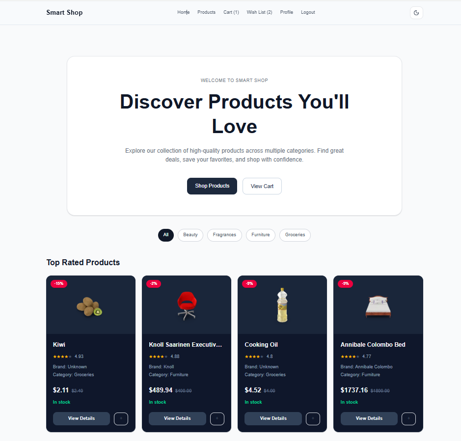
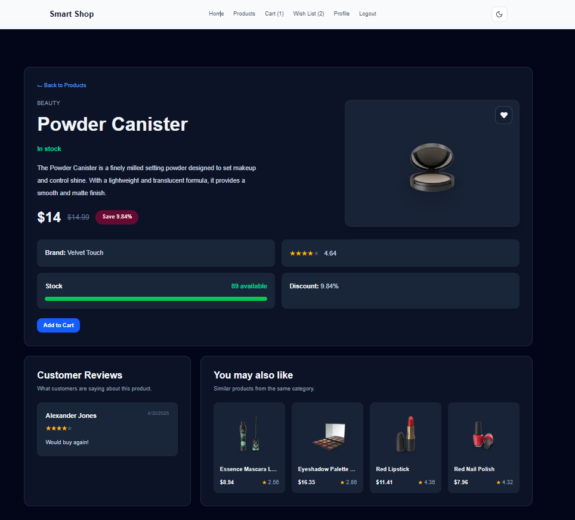
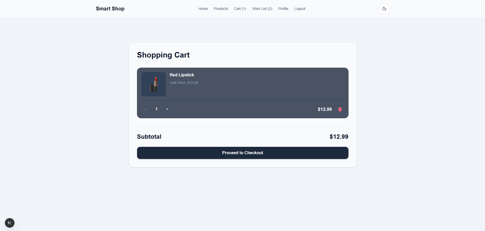
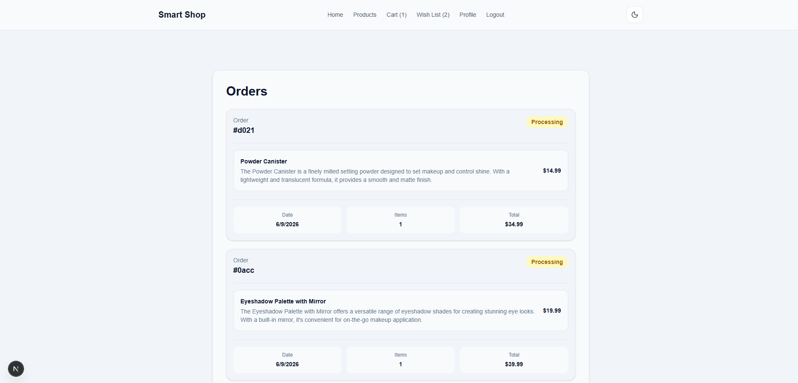

# 🛍️ Smart Shop

A modern and responsive e-commerce web application built with Next.js, TypeScript, Tailwind CSS, and Zustand.

## 🚀 Live Demo

https://smart-shop-liard.vercel.app/

## 📂 GitHub Repository

https://github.com/mandanaghzare/smart-shop

---

## 📖 Overview

Smart Shop is a fully responsive e-commerce application that allows users to browse products, view product details, manage their shopping cart, save favorite items, place orders, and track purchase history.

The project focuses on clean UI design, state management, responsive layouts, dark mode support, and modern frontend development practices.

---

## ✨ Features

### Product Browsing

- Browse products from multiple categories
- Category filtering
- Product cards with pricing and discounts
- Product details page

### Shopping Experience

- Add products to cart
- Update cart quantity
- Remove products from cart
- Wishlist management
- Related products suggestions

### Checkout Flow

- Order placement
- Automatic order creation
- Cart clearing after checkout
- Order history tracking

### User Account

- Mock authentication system
- Register page
- Login page
- Profile dashboard
- Orders overview

### UI & UX

- Fully responsive design
- Dark mode support
- Modern card-based interface
- Persistent client-side state

---

## 🛠️ Tech Stack

### Frontend

- Next.js
- React
- TypeScript
- Tailwind CSS

### State Management

- Zustand
- Local Storage Persistence

### Deployment

- Vercel

---

## 📸 Screenshots

### Home Page



### Product Details



### Shopping Cart



### Orders Page



---

## 📦 Installation

Clone the repository:

```bash
git clone https://github.com/mandanaghzare/smart-shop.git
```

Navigate to the project:

```bash
cd smart-shop
```

Install dependencies:

```bash
npm install
```

Run development server:

```bash
npm run dev
```

Open:

```txt
http://localhost:3000
```

---

## 📁 Project Structure

```txt
app/
├── cart/
├── checkout/
├── login/
├── orders/
├── products/
├── profile/
├── register/
├── wishlist/
├── layout.tsx
└── page.tsx

components/
store/
types/
```

---

## 🔐 Authentication

This project uses a mock authentication system built with:

- Zustand
- Local Storage

Authentication is implemented for learning and portfolio purposes and does not use a backend service.

---

## 🎯 Learning Goals

This project was built to practice:

- Next.js App Router
- TypeScript
- Zustand State Management
- Responsive Design
- Dark Mode Implementation
- Component Architecture
- E-commerce User Flows

---

## 🌐 Deployment

The application is deployed on Vercel:

https://smart-shop-liard.vercel.app/

---

## 👩‍💻 Author

GitHub:
https://github.com/mandanaghzare